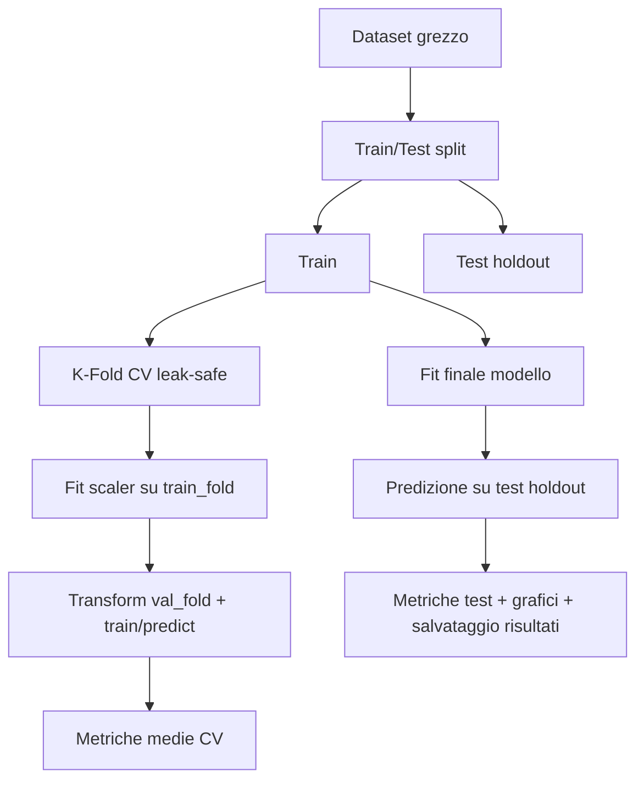

# KNN Regression Parallel - Relazione Tecnica

Relazione tecnica del progetto di regressione sul dataset Combined Cycle Power Plant (CCPP), con confronto tra:
- implementazione custom di KNN Regressor parallelizzata (`KNN_Parallel`);
- baseline con `KNeighborsRegressor` di scikit-learn.

Obiettivo: verificare correttezza metodologica, qualità predittiva e robustezza della pipeline sperimentale, evitando data leakage.

## 1. Obiettivi del progetto

Gli obiettivi principali sono:
- implementare un regressore k-NN custom con predizione parallela;
- confrontare prestazioni e comportamento con la baseline scikit-learn;
- usare una pipeline di valutazione rigorosa (holdout + k-fold);
- generare metriche e grafici diagnostici per il confronto tra modelli.

## 2. Cenni teorici

### 2.1 k-Nearest Neighbors per regressione

Dato un campione $x$, il modello identifica i $k$ punti di training piu vicini e restituisce una media (pesata) dei target associati.

### 2.2 Distanza di Minkowski

La distanza usata e:

$$
d_p(x, x_i) = \left(\sum_{j=1}^m |x_j - x_{i,j}|^p\right)^{1/p}
$$

dove $p=1$ corrisponde a Manhattan e $p=2$ a Euclidea.

### 2.3 Predizione pesata

Nel modello custom, i vicini contribuiscono con peso dipendente dalla distanza; il valore predetto e:

$$
\hat{y}(x) = \sum_{i \in \mathcal{N}_k(x)} w_i y_i, \quad \sum_i w_i = 1
$$

## 3. Dataset

- Fonte: UCI Machine Learning Repository (id=17, Combined Cycle Power Plant).
- Task: regressione del target di output energetico.
- Feature: variabili numeriche continue.

Il dataset viene scaricato (se assente) e salvato in `Assets/CCPP.csv`.

## 4. Architettura del progetto

Il progetto ha logica applicativa in `src/` e entrypoint esterno:

- `main.py`: orchestrazione CLI, training, valutazione, salvataggi e grafici.
- `src/data.py`: loading dataset e preprocessing.
- `src/knn_parallel.py`: implementazione KNN custom parallela.
- `src/knn.py`: implementazione KNN sequenziale (supporto/benchmark locale).
- `src/validazione.py`: validazione k-fold e ricerca iperparametri.
- `src/valutazione.py`: metriche di regressione e validazione input.
- `src/plot.py`: grafici predizioni, residui e confronto metriche.
- `src/plot_distances.py`: visualizzazione delle curve di Minkowski.

Output sperimentali in `Assets/results/`.

## 5. Pipeline sperimentale



## 6. Risultati dell'ultima esecuzione

Configurazione dell'ultima run di controllo:
- `k=2`
- `k-fold=2`
- `test_size=0.2`
- `X_standardization=True`
- `p=2` (Minkowski)

### 6.1 Cross-validation

| Modello | RMSE | MAE | R2 | ExVar | MAPE |
|---|---:|---:|---:|---:|---:|
| KNN_Parallel | 4.267790 | 3.050201 | 0.937511 | 0.937546 | 0.672848 |
| KNN scikit-learn | 4.289893 | 3.075699 | 0.936861 | 0.936895 | 0.678405 |

### 6.2 Test holdout

| Modello | RMSE | MAE | R2 | ExVar | MAPE |
|---|---:|---:|---:|---:|---:|
| KNN_Parallel | 3.882053 | 2.682111 | 0.948044 | 0.948106 | 0.592164 |
| KNN scikit-learn | 3.901644 | 2.698278 | 0.947518 | 0.947576 | 0.595703 |

Interpretazione sintetica:
- i due modelli sono molto vicini;
- il modello custom risulta competitivo sulla configurazione testata;
- il refactor non ha degradato le performance osservate.

## 7. Riproducibilita

Dipendenze principali:
- numpy
- pandas
- scikit-learn
- matplotlib
- seaborn
- joblib
- ucimlrepo

Esecuzione standard:

```bash
uv run python main.py
```

Esecuzione con parametri espliciti:

```bash
uv run python main.py -X true -n 6 -t 0.2 -k 10 -p 2
```

## 8. Conclusioni

Il progetto mostra che una implementazione custom di k-NN regressivo, se supportata da una pipeline corretta e leak-safe, puo raggiungere risultati allineati a una baseline consolidata.

Il refactor in `src/` migliora manutenibilita e chiarezza architetturale, separando orchestrazione (`main.py`) da logica di dominio (`src/*`).