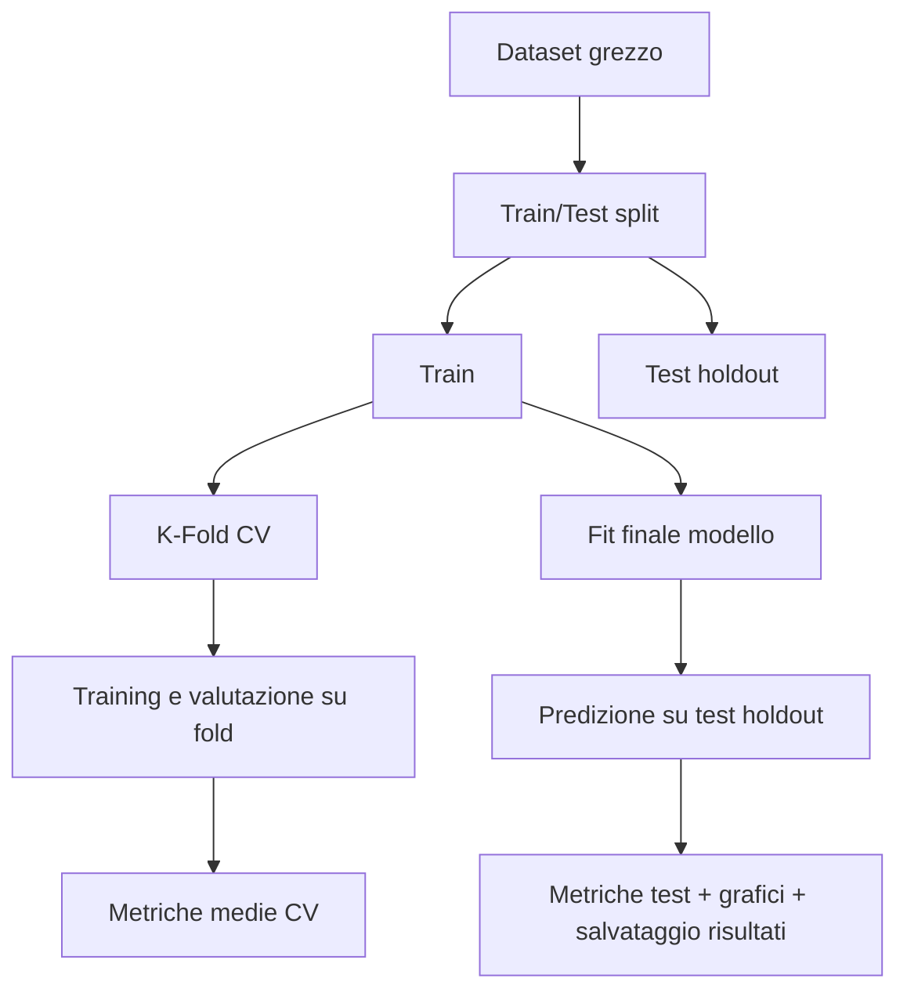

# KNN Regression Parallel - Relazione Tecnica

Relazione tecnica del progetto di regressione sul dataset Combined Cycle Power Plant (CCPP), con confronto tra:
- implementazione custom di KNN Regressor parallelizzata (`KNN_Parallel`);
- baseline con `KNeighborsRegressor` di scikit-learn.

Obiettivo: descrivere il funzionamento del k-NN regressivo, confrontare implementazione custom e baseline scikit-learn, e valutarne le performance sul dataset CCPP.

## 1. Obiettivi del progetto

Gli obiettivi principali sono:
- implementare un regressore k-NN custom con predizione parallela;
- confrontare prestazioni e comportamento con la baseline scikit-learn;
- usare una pipeline di valutazione con holdout e k-fold;
- generare metriche e grafici diagnostici per il confronto tra modelli.

## 2. Cenni teorici

### 2.1 k-Nearest Neighbors per regressione

Dato un campione $x$, il modello identifica i $k$ punti di training piu vicini e restituisce una media (pesata) dei target associati.

### 2.2 Distanza di Minkowski

La distanza usata e:

$$
d_p(x, x_i) = \left(\sum_{j=1}^m |x_j - x_{i,j}|^p\right)^{1/p}
$$

dove $p=1$ corrisponde a Manhattan e $p=2$ a Euclidea.

### 2.3 Predizione pesata

Nel modello custom, i vicini contribuiscono con peso dipendente dalla distanza; il valore predetto e:

$$
\hat{y}(x) = \sum_{i \in \mathcal{N}_k(x)} w_i y_i, \quad \sum_i w_i = 1
$$

## 3. Dataset

- Fonte: UCI Machine Learning Repository (id=17, Combined Cycle Power Plant).
- Task: regressione del target di output energetico.
- Feature: variabili numeriche continue.

Il dataset viene scaricato (se assente) e salvato in `assets/CCPP.csv`.

## 4. Architettura del progetto

Il progetto ha logica applicativa in `src/` e entrypoint esterno:

- `main.py`: orchestrazione CLI, training, valutazione, salvataggi e grafici.
- `src/data.py`: loading dataset e preprocessing.
- `src/knn_parallel.py`: implementazione KNN custom parallela.
- `src/knn.py`: implementazione KNN sequenziale (supporto/benchmark locale).
- `src/validazione.py`: validazione k-fold e ricerca iperparametri.
- `src/valutazione.py`: metriche di regressione e validazione input.
- `src/plot.py`: grafici predizioni, residui e confronto metriche.
- `src/plot_distances.py`: visualizzazione delle curve di Minkowski.

Output sperimentali in `assets/results/`.

## 5. Pipeline sperimentale



## 6. Risultati dell'ultima esecuzione

Configurazione dell'ultima run di controllo:
- `k=2`
- `k-fold=2`
- `test_size=0.2`
- `X_standardization=True`
- `p=2` (Minkowski)

### 6.1 Cross-validation

| Modello | RMSE | MAE | R2 | ExVar | MAPE |
|---|---:|---:|---:|---:|---:|
| KNN_Parallel | 4.267790 | 3.050201 | 0.937511 | 0.937546 | 0.672848 |
| KNN scikit-learn | 4.289893 | 3.075699 | 0.936861 | 0.936895 | 0.678405 |

### 6.2 Test holdout

| Modello | RMSE | MAE | R2 | ExVar | MAPE |
|---|---:|---:|---:|---:|---:|
| KNN_Parallel | 3.882053 | 2.682111 | 0.948044 | 0.948106 | 0.592164 |
| KNN scikit-learn | 3.901644 | 2.698278 | 0.947518 | 0.947576 | 0.595703 |

Interpretazione sintetica:
- i due modelli sono molto vicini;
- il modello custom risulta competitivo sulla configurazione testata;
- il confronto conferma coerenza tra approccio custom e baseline.

## 7. Analisi grafica

### 7.1 Distanza di Minkowski al variare di p

<div style="text-align: center;">
    
</div>

### 7.2 Residui dei due modelli

<div align="center" style="margin-top: 10px; margin-bottom: 10px;">
    
    
</div>

### 7.3 Confronto metriche aggregate

<div style="display: flex; justify-content: space-around; align-items: stretch; gap: 10px; margin-top: 10px;">
    <div style="text-align: center; width: 48%;">
        <p>Confronto in cross-validation:</p>
        
    </div>
    <div style="text-align: center; width: 48%;">
        <p>Confronto su test holdout:</p>
        
    </div>
</div>


## 8. Argomenti da riga di comando

Per vedere guida e argomenti disponibili:

```bash
uv run python main.py --help-args
```

Argomenti principali:

| Argomento | Tipo | Significato |
|---|---|---|
| `-X`, `--X-standardization` | bool | Abilita/disabilita la standardizzazione delle feature prima del training. |
| `-n`, `--n-neighbours` | int | Numero di vicini usato da k-NN. |
| `-t`, `--test-size` | float | Frazione del dataset da usare come test holdout. |
| `-k`, `--k-fold` | int | Numero di fold per la cross-validation. |
| `-p`, `--minkowski` | int | Ordine $p$ della distanza di Minkowski ($p=1$ Manhattan, $p=2$ Euclidea). |
| `--auto-tune` | flag | Esegue una ricerca automatica di `k` e `p` sul modello custom via cross-validation. |
| `--help-args` | flag | Stampa una guida estesa degli argomenti e termina. |

Esempio completo:

```bash
uv run python main.py -X true -n 6 -t 0.2 -k 10 -p 2
```

Esempio con tuning automatico:

```bash
uv run python main.py --auto-tune
```

Nota: durante il tuning non vengono generati plot intermedi; i plot vengono salvati solo al termine dell'esecuzione.

## 9. Riproducibilita

Dipendenze principali:
- numpy
- pandas
- scikit-learn
- matplotlib
- seaborn
- joblib
- ucimlrepo

Esecuzione standard:

```bash
uv run python main.py
```

## 10. Conclusioni

Il progetto mostra che una implementazione custom di k-NN regressivo puo raggiungere risultati allineati a una baseline consolidata.

L'organizzazione con `main.py` come entrypoint e moduli in `src/` mantiene separata l'orchestrazione dalla logica applicativa.